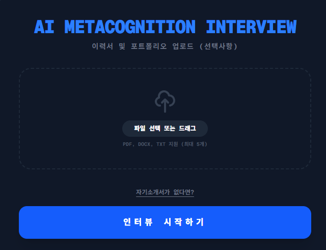
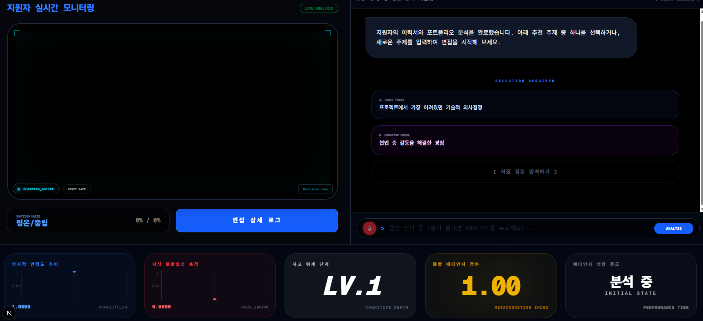
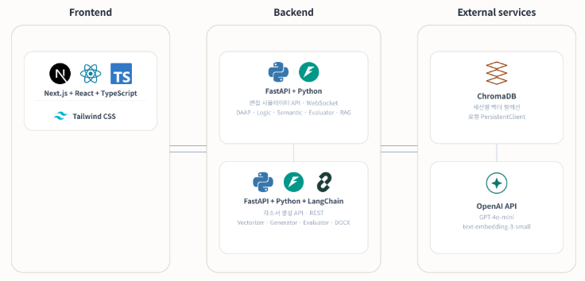

# AI 메타인지 면접 시뮬레이터

<p align="center">
  답변 품질에 따라 질문이 실시간으로 진화하는 적응형 AI 면접 시뮬레이터
</p>

---

## 1. 프로젝트 소개

### 프로젝트 개요

지원자의 답변을 논리적 정합성·의미론적 확신도·인지 위계·표정/시선까지 다축으로 실시간 분석해, 답변 품질에 따라 질문의 난이도와 방향이 동적으로 바뀌는 적응형 면접 시뮬레이터입니다. 기존 면접 준비 도구는 대부분 고정된 "예상 질문 리스트"를 제공하는 데 그쳐 지원자가 실제로 얼마나 깊이 이해하고 있는지 검증하지 못한다는 문제의식에서 출발했습니다. 부가기능으로 채용정보 기반 키워드 추출과 STAR 구조 초안 생성, AI 자동 QA 채점까지 지원하는 자기소개서 생성기를 포함합니다.

### 프로젝트 정보

| 항목      | 내용                        |
| ------- | ------------------------- |
| 프로젝트명   | AI 메타인지 면접 시뮬레이터           |
| 제작 기간   | 2026.07.15 ~ 2026.07.30 |
| 팀원 수    | 1명 (개인 프로젝트)              |
| 프로젝트 유형 | 개인 프로젝트 |
| 담당 역할   | 기획·설계·개발 전체 (프론트엔드, 면접 시뮬레이터 백엔드, 자기소개서 생성기 백엔드) |

---

## 2. 주요 기능

### 2.1 적응형 질문 전략 (DAAP) + 생존 확률 추적

답변 품질에 따라 답변 보강 요구 / 심층 탐침 / 주제 전환 3가지 모드를 자동 분기하는 DAAP(Domain-Agnostic Adaptive Probing) 알고리즘입니다. 논리 일관성·의미 불확실성·표정·시선 점수를 종합한 "생존 확률" 단일 지표로 지원자 상태를 실시간 추적하고, 3단계 임계치(STABLE / CAUTION / LIMIT_REACHED)로 경고합니다.

* Bloom's Taxonomy 인지 위계(1~6단계) + 논리 정합성 + 관련성을 가중합산하는 CIQS 채점으로 S+~F 5단계 등급 산출
* 최대 15 depth, 3의 배수 depth마다 자동 주제 전환
* 질문 옵션 2개(temperature 0.1 / 0.7)를 동시 스트리밍 생성

### 2.2 RAG 기반 이력서 사실관계 검증

업로드된 이력서/포트폴리오(PDF·DOCX·TXT)를 벡터화해 답변마다 관련 근거를 검색하고 사실관계 모순을 판별합니다. PyMuPDF 1차 추출이 실패(50자 미만)하면 Tesseract OCR(한/영)로 자동 폴백해 스캔본 이력서도 지원합니다.

* 세션 종료 시 ChromaDB 컬렉션과 업로드 파일 자동 삭제 (개인정보 파기)
* face-api.js 기반 7가지 표정 확률 + 시선 히트맵으로 CV 점수 산출(표정 70% + 시선 30%)

### 2.3 AI 자기소개서 초안 생성기 (부가 기능)

워크넷(Work24) 공공 채용 API로 키워드를 추출하고(실패 시 GPT-4o-mini 폴백), STAR 구조(지원동기·직무역량·성장과정·입사후포부)로 초안을 생성합니다. 미확정 수치는 플레이스홀더로 남겨 허구 사실 생성을 방지하고, 직무 키워드 일치도·원본 보존율·플레이스홀더 완료율 3개 게이트로 QA를 자동 채점합니다.

* python-docx로 서식이 적용된 DOCX 파일 다운로드 지원

---

## 3. 화면 구성

### 이력서 업로드 및 시작 화면



면접을 시작하는 진입 화면입니다. 이력서·포트폴리오(PDF·DOCX·TXT, 최대 5개)를 업로드하면 RAG 색인 후 면접이 시작되며, 자기소개서가 없는 경우 "자기소개서가 없다면?" 링크로 자기소개서 생성기(부가 기능)로 바로 이동할 수 있습니다.

### 실시간 면접 진행 화면



지원자의 이력서·포트폴리오 분석이 끝나면 추천 주제 2가지 또는 직접 입력한 주제로 면접을 시작합니다. 답변마다 표정/시선(EMOTION/GAZE), 인지적 안정도 추이(Stability Index), 지식 불확실성(Noise Factor), 사고 위계 단계(Cognitive Depth), 종합 메타인지 점수(Metacognition Index)가 실시간으로 갱신됩니다.

---

## 4. 기술 스택

### Language

* TypeScript (프론트엔드)
* Python (백엔드)

### Frontend

* Next.js 16.2.6, React 19.2.4, TypeScript
* Tailwind CSS 4
* Zustand (상태 관리)
* Recharts (실시간 메트릭 차트)
* react-webcam + @vladmandic/face-api (표정/시선 분석)

### Backend — 면접 시뮬레이터 (포트 8000)

* FastAPI, WebSocket (실시간 통신)
* OpenAI GPT-4o-mini (질문 생성·자동 채점)
* ChromaDB + OpenAI Embedding(`text-embedding-3-small`) (RAG 벡터 검색)
* PyMuPDF, pytesseract, pdf2image, python-docx, langchain-text-splitters (문서 처리)

### Backend — 자기소개서 생성기 (포트 8001, 부가 기능)

* FastAPI, LangChain, langchain-openai
* scikit-learn (TF-IDF · 코사인 유사도)
* 워크넷 Open API(Work24)

### Development / Collaboration

* GitHub
* Figma (화면 설계)
* Postman (API 테스트)

`backend/requirements.txt`에 `z3-solver`가 포함되어 있지만 실제 로직에서는 사용되지 않으며, 논리적 일관성 판단은 GPT-4o-mini 프롬프트 기반 다차원 평가로 수행됩니다.

---

## 5. 시스템 아키텍처



Next.js 프론트엔드가 WebSocket으로 면접 시뮬레이터 백엔드(FastAPI, 8000)와 통신합니다. 세션마다 `DAAPEngine`·`LogicEngine`·`SemanticEngine`·`Evaluator`를 독립적으로 생성해 동시 접속 세션 간 상태가 섞이지 않도록 격리합니다. 답변 처리는 의미분석·논리검증·채점·RAG 검색을 `asyncio.gather`로 병렬 실행해 지연을 최소화합니다. 자기소개서 생성기는 별도 포트(8001)의 독립 FastAPI 서비스로 분리되어 있으며, 동일 프론트엔드에서 하나의 사용자 흐름으로 통합됩니다.

### 구성 요소

| 구성 요소 | 역할 |
| --- | --- |
| Frontend (Next.js) | 웹캠·채팅 UI, 실시간 메트릭 차트, 이력서 업로드 |
| 면접 시뮬레이터 백엔드 (FastAPI, WS 8000) | DAAP 적응형 질문, 논리/의미 분석, RAG 검색, CIQS 채점 |
| 자기소개서 생성기 백엔드 (FastAPI, 8001) | 채용 키워드 추출, STAR 초안 생성, QA 채점 |
| ChromaDB | 세션별 격리된 이력서/포트폴리오 벡터 컬렉션 |
| OpenAI API | 질문 생성, 채점, 임베딩 |
| 워크넷 Open API | 채용정보 기반 키워드 추출 |

---

## 6. 프로젝트 구조

```text
mini-project/
├── backend/                    # 면접 시뮬레이터 백엔드 (FastAPI, 8000)
│   ├── main.py                  # WebSocket 엔드포인트, 세션 관리
│   ├── daap_engine.py           # 적응형 질문 전략(DAAP)
│   ├── logic_engine.py          # 논리 정합성 평가
│   ├── semantic_engine.py       # 의미 불확실성 평가
│   ├── evaluator.py             # CIQS 종합 채점
│   ├── rag_engine.py            # 이력서 RAG 검색
│   ├── chroma_db/                # 세션별 벡터 컬렉션 (로컬 저장)
│   ├── uploads/                  # 업로드된 이력서/포트폴리오
│   ├── coverletter_backend/     # 자기소개서 생성기 (FastAPI, 8001, 부가 기능)
│   │   └── app/
│   │       ├── main.py
│   │       ├── models/
│   │       ├── services/         # jd_builder, generator, evaluator, retriever, vectorizer
│   │       └── utils/
│   └── requirements.txt
├── frontend/                   # Next.js 프론트엔드
│   ├── app/
│   │   ├── page.tsx
│   │   ├── components/
│   │   ├── coverletter/          # 자기소개서 생성기 페이지
│   │   └── lib/
│   └── public/                   # 아키텍처 이미지
└── README.md
```

### 주요 디렉토리

| 디렉토리 | 설명 |
| --- | --- |
| `backend/` | 면접 시뮬레이터: DAAP 질문 전략, 논리/의미 분석, RAG, 채점 엔진 |
| `backend/coverletter_backend/` | 자기소개서 생성기 (부가 기능, 별도 FastAPI 서비스) |
| `frontend/app/coverletter/` | 자기소개서 생성기 프론트엔드 페이지 |

---

## 7. 트러블슈팅

<details>
<summary><b>7.1 생존확률 알고리즘 민감도 튜닝</b> — 지원자가 한 번 실수해도 생존확률이 거의 깎이지 않는 둔감한 반응</summary>

**Why**
하락 쿠션 계수와 성능 가중치가 실수 하나를 충분히 반영하지 못하도록 설정되어 있었고, 붕괴 판정 임계치도 상황에 맞지 않았습니다.

**Solution**
하락 쿠션 계수(0.8→0.9), 성능 가중치(0.70:0.30→0.60:0.40, 실수 페널티 33% 증가), 일관성 붕괴 시 추가 15% 감점 로직을 순차 도입했습니다. 붕괴 판정 임계치는 0.25로 올렸다가 경고가 너무 잦아져 0.20으로 되돌리는 등, 임계치·가중치·쿠션 로직을 나눠서 반복 조정했습니다.

**Result**
실수 1회에도 생존확률이 적절히 반응하면서, 과도한 경고 없이 민감도 균형점을 확보했습니다.

**Takeaway**
생존확률 쿠션계수·가중치·임계치를 반복 조정하며, 정성적 지표도 여러 차례 실험을 거치면 정량적으로 다듬을 수 있다는 것을 학습했습니다.

</details>

<details>
<summary><b>7.2 이미지 기반 PDF 텍스트 추출 실패</b> — 스캔본 이력서에서 PyMuPDF 1차 추출 시 텍스트가 거의 나오지 않음</summary>

**Why**
스캔본 PDF는 이미지로만 구성되어 있어 텍스트 레이어 기반 추출 방식으로는 내용을 읽을 수 없었습니다.

**Solution**
추출 결과가 50자 미만이면 `pdf2image` + `pytesseract`(한/영 동시 인식)로 자동 폴백하도록 처리했습니다.

**Result**
순수 텍스트 PDF와 스캔 PDF를 모두 지원하는 실사용 시나리오 대응이 가능해졌습니다.

**Takeaway**
하나의 방식(텍스트 레이어 추출)이 모든 입력 형태를 커버하지 못할 수 있으므로, 결과 품질을 검사해 실패로 판단되면 대안 방식(OCR)으로 자동 전환하는 폴백 전략이 실사용 시나리오의 커버리지를 크게 넓혀준다는 것을 배웠습니다.

</details>

<details>
<summary><b>7.3 실시간 응답 지연</b> — 의미분석·논리검증·채점·RAG 검색을 순차 실행할 때 지연이 누적됨</summary>

**Why**
답변 하나당 의미분석·논리검증·채점·RAG 검색을 순차 실행하는 구조라 지연이 누적되었습니다.

**Solution**
`asyncio.gather`로 4개 작업을 병렬 실행하도록 구조를 변경했습니다. 질문 옵션 2개도 순차가 아닌 병렬 스트리밍으로 동시 생성했습니다.

**Result**
asyncio 기반 병렬 처리로 체감 응답 속도를 크게 줄였습니다.

**Takeaway**
asyncio 기반 병렬 처리로 체감 응답 속도를 크게 줄이는 것을 직접 검증하며, 구조 설계가 성능에 미치는 영향을 실감했습니다.

</details>

<details>
<summary><b>7.4 공공 API 접근 제한 대응</b> — 워크넷 API를 개인회원 키로 호출하면 "개인회원" 제한 메시지가 반환됨</summary>

**Why**
공공데이터 API가 회원 등급에 따라 접근 범위를 제한하고 있어, 개인회원 키로는 일부 데이터를 받을 수 없었습니다.

**Solution**
제한 메시지를 문자열로 감지해 즉시 LLM 폴백(직무명만으로 GPT가 키워드·표준역량 추론)으로 전환하도록 처리했습니다.

**Result**
외부 공공데이터 API의 불안정성·권한 제약을 자체 감지 로직으로 흡수해 서비스 중단 없이 동작하도록 만들었습니다.

**Takeaway**
외부(특히 공공) API는 문서화되지 않은 권한 제약이나 실패 응답을 반환할 수 있으므로, 이를 감지해 자동으로 대체 경로(LLM 폴백 등)로 전환하는 방어적 설계가 서비스 안정성에 중요하다는 것을 배웠습니다.

</details>

---

## 8. 테스트

### 테스트 환경

* `coverletter_backend/test_api.py` — 자기소개서 DOCX 다운로드(`/api/download/docx`) 엔드포인트용 수동 스모크 테스트 스크립트

### 테스트 방법

```bash
cd backend/coverletter_backend
python test_api.py
```

### 테스트 결과

`requests`로 `/api/download/docx`에 샘플 데이터를 POST해 응답 상태 코드 200을 확인했습니다. 정식 유닛/통합 테스트는 아직 작성되어 있지 않습니다.

---

## 9. 실행 방법

### 요구 사항

* Node.js
* Python
* Tesseract OCR (스캔본 이력서 인식용)
* OpenAI API 키, 워크넷 API 키(선택)

### 설치 및 실행 — 면접 시뮬레이터 백엔드

```bash
cd backend
pip install -r requirements.txt
# .env 파일에 OPENAI_API_KEY 설정
python main.py   # http://localhost:8000
```

### 설치 및 실행 — 자기소개서 생성기 백엔드

```bash
cd backend/coverletter_backend
pip install -r requirements.txt
# .env 파일에 OPENAI_API_KEY, WORKNET_API_KEY 설정
python -m app.main   # http://localhost:8001
```

### 설치 및 실행 — 프론트엔드

```bash
cd frontend
npm install
npm run dev   # http://localhost:3000
```

### 사용 흐름

1. `http://localhost:3000`에서 이력서/포트폴리오를 업로드하거나, `/coverletter` 페이지에서 자기소개서 초안을 먼저 생성
2. 면접 화면에서 추천 주제 중 하나를 선택하거나 직접 주제 입력
3. 답변할 때마다 사이드바에서 생존 확률·의미 에너지·Bloom 레벨·CIQS 등급을 실시간 확인
4. 생존 확률이 임계치 이하로 떨어지거나 논리적 모순이 감지되면 시스템 경고 및 주제 전환 권장

---

## 10. API 명세서

개인 프로젝트로 별도의 기획 문서·발표 자료는 없어, 실제 코드 기준 API 명세만 정리했습니다. 각 엔드포인트의 상세 스펙은 실행 후 Swagger UI(`/docs`)에서도 확인할 수 있습니다.

### 면접 시뮬레이터 백엔드 (`http://localhost:8000`)

| Method | Endpoint | 설명 | 요청 | 응답 |
| --- | --- | --- | --- | --- |
| GET | `/` | 헬스체크 | - | `{"message": "AI Metacognition Interview Simulator API"}` |
| POST | `/upload` | 이력서/포트폴리오 업로드 및 RAG 색인 | multipart: `files[]`, `session_id`(선택) | `{session_id, total_chunks}` |
| WS | `/ws/interview` | 실시간 면접 세션. 답변마다 다축 분석·다음 질문을 스트리밍 | 아래 WebSocket 메시지 참고 | 아래 WebSocket 메시지 참고 |

**WebSocket(`/ws/interview`) 클라이언트 → 서버 메시지**

| type | 필드 | 설명 |
| --- | --- | --- |
| (초기) | `session_id` | 이력서 업로드로 받은 세션 ID (선택) |
| `answer` | `content`, `expression`, `expression_probability`, `gaze_focus` | 답변 텍스트 + 표정/시선 분석 값 |
| `select` | `content` | 추천 주제 선택 또는 직접 입력한 다음 주제 |

**WebSocket(`/ws/interview`) 서버 → 클라이언트 이벤트**

| type | 설명 |
| --- | --- |
| `probe` | 초기 환영 메시지 + 추천 주제 3개 |
| `metrics_update` | 생존확률·의미에너지·Bloom레벨·CIQS·등급 등 실시간 메트릭 |
| `option_chunk` | 질문 옵션(temperature 0.1/0.7) 스트리밍 조각 |
| `question_options_complete` | 질문 옵션 2개 생성 완료 |
| `alert` | 생존확률 붕괴 등 시스템 경고 |

### 자기소개서 생성기 백엔드 (`http://localhost:8001`)

| Method | Endpoint | 설명 | 요청 | 응답 |
| --- | --- | --- | --- | --- |
| POST | `/api/user/profile` | 사용자 프로필 저장 및 벡터 색인 | `UserProfile` (JSON) | `{status, chunks_indexed}` |
| GET | `/api/jd/build` | 채용정보 기반 JD 컨텍스트 생성 (워크넷 API → 실패 시 LLM 폴백) | query: `job_name` | `JDContext` |
| POST | `/api/draft/generate` | RAG 검색 기반 STAR 구조 자소서 초안 생성 | query: `user_id`, body: `JDContext` | `DraftResponse` |
| POST | `/api/draft/weave` | 초안에 기업 정보 위빙 | query: `user_id`, body: `company_info` | `DraftResponse` |
| POST | `/api/qa/evaluate` | 직무 일치도·보존율·플레이스홀더 완료율 QA 채점 | query: `user_id`, body: `edited_sections` | `QAEvaluation` |
| POST | `/api/download/docx` | 서식 적용된 DOCX 파일 다운로드 | query: `job_name`, body: `edited_sections` | DOCX 파일 스트림 |

**주요 스키마**

| 모델 | 주요 필드 |
| --- | --- |
| `UserProfile` | `target_job`, `age`, `tech_stack[]`, `certifications[]`, `experience`, `strength`, `motivation` |
| `JDContext` | `job_name`, `context`, `keywords[]`(keyword, frequency) |
| `DraftResponse` | `sections[]`(section_name, situation, action_draft, result_hint, placeholder_metrics[]) |
| `QAEvaluation` | `job_alignment`, `content_preservation`, `placeholder_completion`, `gate_passed`, `feedback[]` |

---

## 11. 회고 및 성과

### 담당 업무

* 프론트엔드(Next.js), 면접 시뮬레이터 백엔드(FastAPI), 자기소개서 생성기 백엔드(FastAPI) 전체 기획·설계·개발

### 주요 성과

* 4개 분석 엔진(논리·의미·인지위계·생존확률)을 `asyncio.gather`로 병렬 실행하는 실시간 파이프라인 구현
* 질문 옵션 2개(temperature 0.1 / 0.7)를 동시 스트리밍 생성
* 워크넷 API 연동 실패 시 LLM 폴백으로 전환하는 장애 허용 구조 구현
* 세션 종료 시 ChromaDB 컬렉션·업로드 파일을 자동 삭제하는 개인정보 파기 로직 구현

### 기술적으로 해결한 문제

* 위 트러블슈팅 7.1~7.4 참고

### 프로젝트를 통해 배운 점

생존확률 쿠션계수·가중치·임계치를 반복 조정하며, 정성적 지표도 여러 차례 실험을 거치면 정량적으로 다듬을 수 있다는 것을 학습했습니다. 또한 asyncio 기반 병렬 처리로 체감 응답 속도를 크게 줄이는 것을 직접 검증하며, 구조 설계가 성능에 미치는 영향을 실감했습니다.

### 개선할 점

실제 데이터가 부족해 생존확률 임계치가 다양한 상황에 얼마나 잘 맞는지 충분히 검증하지 못했습니다. 혼자 진행하다 보니 코드 리뷰나 다른 관점의 피드백을 받을 기회가 적었던 점도 아쉬웠습니다. 향후에는 실사용자 베타 테스트를 통해 임계치·질문 전략을 재조정하고, 현재 범용 질문 위주인 구성을 직무별 맞춤 질문 템플릿으로 확장할 계획입니다.
